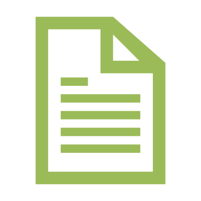

# Maintain code snippets in Azure docs

Run all scripts referenced below either locally or in GitHub Codespaces.  See [Setup](setup.md) for further instructions.

[](https://codespaces.new/sdgilley/content-maintenance?quickstart=1)

When using this process, you'll create PRs in each of the following repositories:

- ** Code Repo** - GitHub repositories where sample code is stored (Currently for ML and Foundry: azureml-examples, foundry-samples, and azureai-samples)
- **  Docs Repo** - The MicrosoftDocs repository where documentation articles are stored - currently hardcoded to MicrosoftDocs/azure-ai-docs
- **  Maintenance Repo** - The content maintenance repository you're viewing now, containing monitoring and reporting scripts

## Daily tasks - monitor the  Code Repos

### Check PRs

1. Check for PRs that need review:

    ```
    python find-prs.py
    ```

1. Review the output in pr-review-report-DATE.md.  Set to Preview (Ctrl=Shift-V) to make it easier to read.
1. For each PR, use the python command shown in the Report column.
1. Approve if no issues reported.
1. If issues are present, see [Fix the Problem](fix-the-problem.md).

### Check messages

1. Check for message at the [AI Platform Docs teams channel](https://teams.microsoft.com/l/channel/19%3AHhf4F_YfPn3kYGdmWvePNwlbF5-RR8wciQEUwwrcggw1%40thread.tacv2/General?groupId=fdaf4412-8993-4ea6-a7d4-aeaded7fc854&tenantId=72f988bf-86f1-41af-91ab-2d7cd011db47). 

1. If you're asked to review a PR, in the terminal, run:

    * for azureml-examples repo:

        ```bash
        python pr-report.py <PR number> 
        ```

    * for foundry-samples repo:

        ```bash
        python pr-report.py <PR number> ai
        ```

    * for azureai-samples repo:

        ```bash
        python pr-report.py <PR number> ai2
        ```

## Weekly tasks - update files

On a weekly basis, update the files that make the scripts work correctly. And update articles that have recent code changes.

### Search docs for updates

Use the find-snippets script to find all the docs that reference code repos.  

1. Run this script (takes approximately 10-12 minutes for the current three code repos):

    ```bash
    python find-snippets.py
    ```

### Update files -  Maintenance Repo

1. If changes to any `*.txt` files appear, commit them to sdgilley/content-maintenance. 

### Update codeowners files -  Code Repos

1. If changes to **CODEOWNERS-azureml-examples.txt** appear, copy the content and commit to [azureml-examples CODEOWNERS](https://github.com/Azure/azureml-examples/blob/main/.github/CODEOWNERS) file.
1. If changes to **CODEOWNERS-foundry-samples.txt** appear, copy the content and commit to [foundry-samples CODEOWNERS](https://github.com/Azure-AI-Foundry/foundry-samples/blob/main/.github/CODEOWNERS) file.
1. If changes to **CODEOWNERS-azureai-samples.txt** appear, copy the content and commit to [azureai-samples CODEOWNERS](https://github.com/Azure-Samples/azureai-samples/blob/main/.github/CODEOWNERS) file.

### Update docs -  Docs Repo

When code changes in a code repository, the corresponding document won't update until the next time it's built.  Find related documents by using the merge report.  A change in metadata in these articles will force a build, allowing it to update to the latest code content.

1. Run the merge report.  If last run 7 days ago, simply run:

    ```bash
    python merge-report.py 
    ```

    The report will show PRs merged in the last 8 days.  (The extra day insures that you don't miss a merge that happened after your report 7 days ago.)  
1. If longer than 7 days since last run, add a days parameter to the command.:

    ```bash
    python merge-report.py <days>
    ```

1. Modify the files in azure-ai-docs-pr as listed in the report.  If there are more than 10 files, break it into multiple PRs to be eligible for auto-merge. (You'll see three separate sections, make sure you look at results from all three.)

1. You might want to copy the report output to your work item.  This will let you see when it was last run, so that you can adjust days accordingly for your next report.
